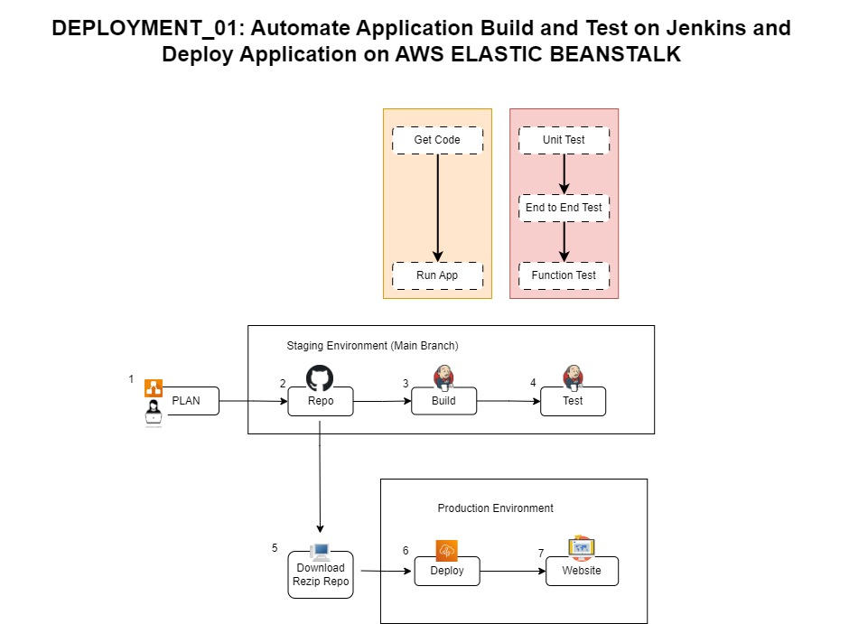

<h1 align="center">Run a Jenkins Build and 
 Manually Deploy to Elastic Beanstalk<h1> 

##Step #1 Plan Deployment and map it out
Use Draw.io to map out the deployment plan

##Step #2 Upload Repository to GitHub

Upload repository to GitHub and generate GitHub token

**Step #3 and Step #4:  Use Jenkins to Auto Build and Test Application**

Log into Jenkins create a build Annie_L for the application from GitHub Repository https://github.com/LamAnnieV/Deployment_01.git

**RUN THE BUILD**
All Stages Passed
Total Build took less than 25 seconds to build
Build Stage took less than 10 seconds, Test Stage took less than 1 sec

Pipeline Stages
Obtained Jenkinsfile from GitHub
Run jenkins in Workspace
Clone Git repository
git-init:  initialize Jenkins library

BUILD
sh '''#!/bin/bash:  Use bash to execute in shell
python3 -m venv test3:  create virtual environment for python3
source test3/bin/activate
pip install pip --upgrade
pip install -r requirements.txt
export FLASK_APP=application:  The FLASK_APP environment variable is used to specify how to load the application.  Load application from file application.py

py.test --verbose --junit-xml test-reports/results.xml

TEST
sh '''#!/bin/bash
source test3/bin/activate
py.test --verbose --junit-xml test-reports/results.xml:  Instructions to test 

**Step #5:  Download Repository from GitHub**
Unzip and rezip repository

**Step #6:  Deploy Application on AWS ELASTIC BEANSTALK**

**Create AWS IAM Role to manually deploy application in AWS EC2 and Elastic Beanstalk**
Create EBS Role
AWS/IAM/Roles/Create Role/Select:  AWS Service/[Use Case] Use Cases for other AWS services:  Elastic Beanstalk/Select:  Elastic Beanstalk - Customizable/Next
Next
Role Name:  aws-elasticbeanstalk-service-role/Create Role

Create EC2 Role
AWS/IAM/Roles/Create Role/Select:  AWS Service/[Use Case] Select:  EC2/Next
[Permissions Policies] Select:   "AWSElasticBeanstalkWebTier" & “AWSElasticBeanstalkWorkerTier”/Next
Role Name:  Elastic-EC2/Create Role

**Deploy application in AWS EC2 and Elastic Beanstalk**
AWS/Elastic Beanstalk/Environments/Create Environment/Application Name:/[Platform-4] Platform:  Python/Platform Branch:  Python 3.9 running on 64bit Amazon Linux 2023/Select:  Upload Your code/Version Label:  v#/Select: Local File/Choose File:  {files that was downloaded from GitHub, Unzipped, then rezipped}/Next
[EC2 instance profile] Select:  Elastic-EC2/Next
[Virtual Private Cloud] Select:  default VPC/[Instance Subnets] Select:  us-east-1a/Next
[Instances] Root Volume Type:  General Purpose (SSD)/Size:  10/[Capacity] Instance Types:  Deselect all & Select t2.micro/None
Next
Submit

**Deployment #1 Results**
Deployment Failed, health status was "Degraded"

**Debug**
Possible areas that might result in an unsuccessful deployment:
1.  AWS roles were setup incorrectly - no issue with roles
    Verify Elastic-EC2 Role includes "AWSElasticBeanstalkWebTier" & “AWSElasticBeanstalkWorkerTier” 
    Verify aws-elasticbeanstalk-service-role Role includes AWS Elastic Beanstalk Service

2.  Issues with uploaded files to AWS
   Looked into the the zip file that was uploaded to ADW.  Issue:  Zip folder, Deployment_01-main.zip, includes a file folder, Deployment_01-main, where all the files are in.

Resolution
1.  Unzip the file, go into the new folder Deployment_01-main and select the files and folders, Zip files, select Add to...
2.  Re-Upload and deploy
   
**Deployment #2 Results**
Deployment successful, health status "OK"

**Step #7:  Launch Website**
Successful

