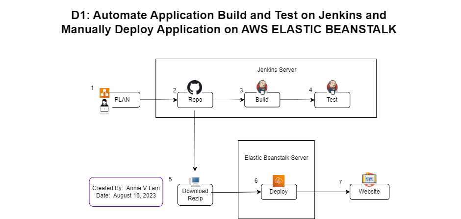

# Manually Deploy a Flask Application to Elastic Beanstalk

By:  Annie V Lam - Kura Labs

August 16, 2023


# Purpose

Manually Deploy a Flask Application to Elastic Beanstalk.


## Step #1 Plan Deployment




## Step #2 Upload Repository to GitHub

Upload the repository to GitHub and generate a [GitHub token](https://github.com/LamAnnieV/GitHub/blob/main/Generate_GitHub_Token.md)


## Step #3 and Step #4:  Use Jenkins to Auto Build and Auto Test Application

Log into Jenkins create a build for the application from GitHub Repository https://github.com/LamAnnieV/Deployment_01.git and run the build

### Results


### Pipeline Stages


**BUILD Stage**

```
sh '''#!/bin/bash:  Use bash to execute in shell

python3 -m venv test3:  create virtual environment for python3

source test3/bin/activate

pip install pip --upgrade

pip install -r requirements.txt

export FLASK_APP=application:  The FLASK_APP environment variable is used to specify how to load the application.  Load application from file application.py

py.test --verbose --junit-xml test-reports/results.xml
```

**TEST Stage**

```
sh '''#!/bin/bash

source test3/bin/activate

py.test --verbose --junit-xml test-reports/results.xml:  Instructions to test
```


## Step #5:  Download Repository from GitHub

Download Repository, unzip files, and re-zip files


## Step #6:  Deploy Application on AWS ELASTIC BEANSTALK

**Create AWS IAM roles to manually deploy the application on Elastic Beanstalk**

How to set up [IAM Role](https://github.com/LamAnnieV/Setup_AWS/blob/main/Create_AWS_IAM_Roles.md).  

**Deploy application on Elastic Beanstalk**

How to deploy the application to Elastic Beanstalk, click [here](https://github.com/LamAnnieV/AWS_Services/blob/main/elastic_beanstalk.md).

**Deployment Attempt #1 Results**

Deployment Failed, health status was "Degraded"
   
**Deployment Attempt #2 Results**


## Step #7:  Launch Website


## Issue(s)

Possible areas that might result in an unsuccessful deployment:
1.  AWS roles were set incorrectly - no issue with roles
    Verify Elastic-EC2 Role includes "AWSElasticBeanstalkWebTier" & “AWSElasticBeanstalkWorkerTier” 
    Verify AWS-elastic beanstalk-service-role Role includes AWS Elastic Beanstalk Service

2.  Issues with uploaded files to AWS
   Looked into the the zip file that was uploaded to ADW.  Issue:  The zip folder, Deployment_01-main.zip, includes a file folder, Deployment_01-main, where all the files are in.

## Resolution
1.  Unzip the file, go into the new folder Deployment_01-main, and select the files and folders, Zip files, select Add to...
2.  Re-upload and deploy
